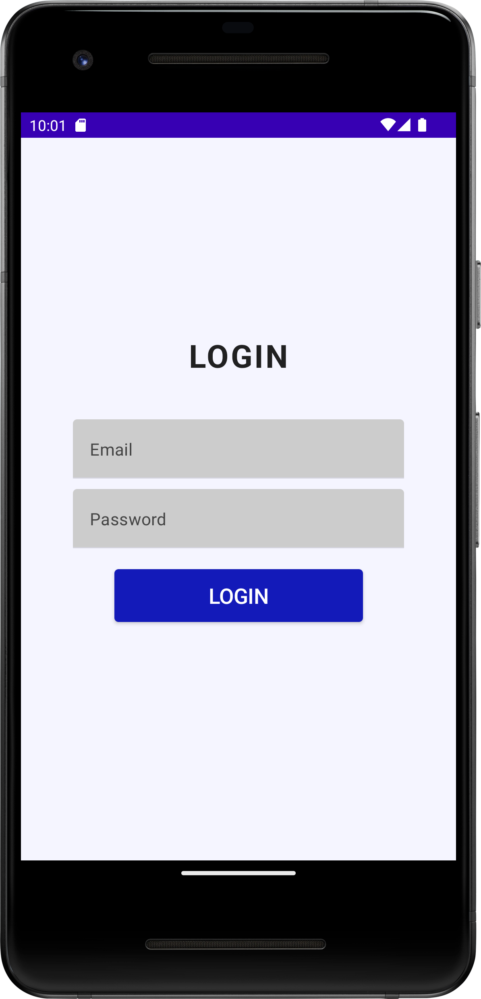
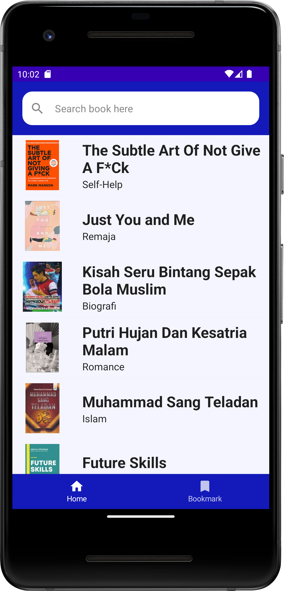
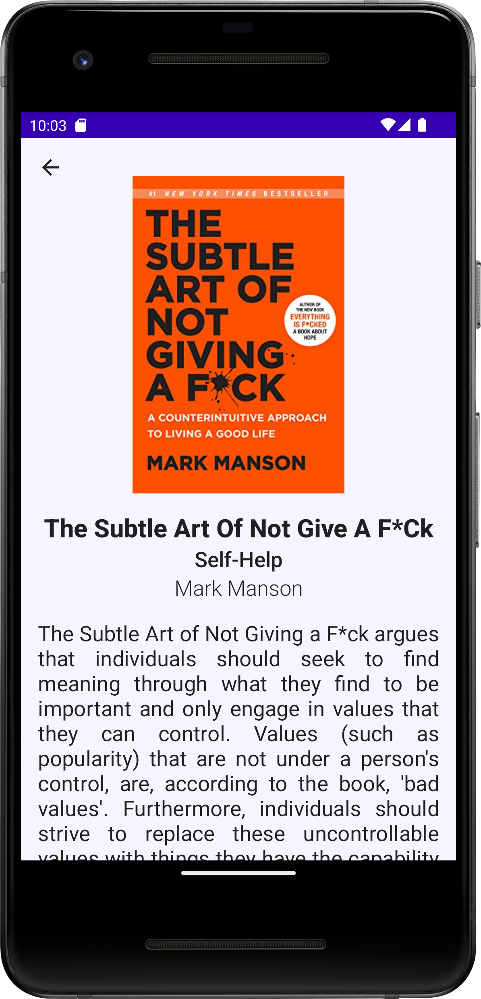
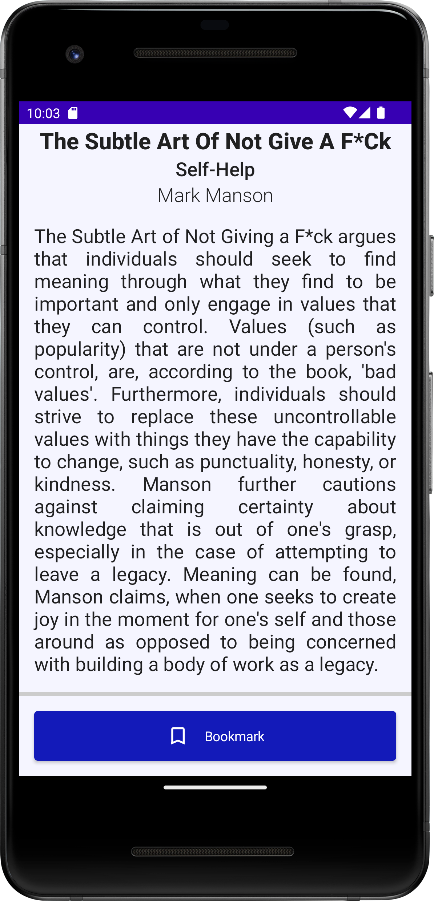
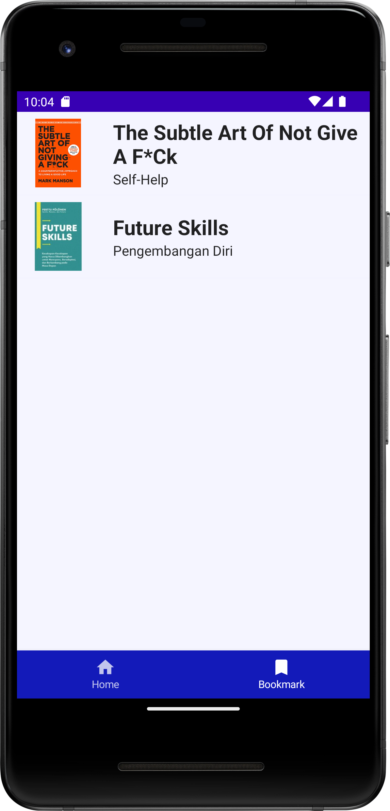

# MyBookmate
Bangkit 2023 Product Capstone Project - Team C23-PS451

MyBookmate is a mobile application for people to access and read books for affordable price.
There are 2 ways to access the book. First, you need to pay for the subscription to access the books.
Second, if you don’t have money for subscription, don’t worry there are some free books that rolled for every weeks so that you can read it even if you don’t subscribe.
MyBookmate also has feature to display some books recommendation based on what you have read.

MyBookmate Feature:
- Book Recommendation System
- Subscription System
- Bookmark

